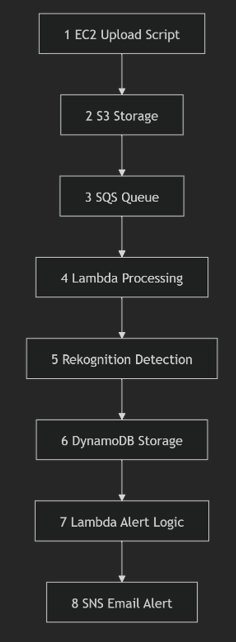
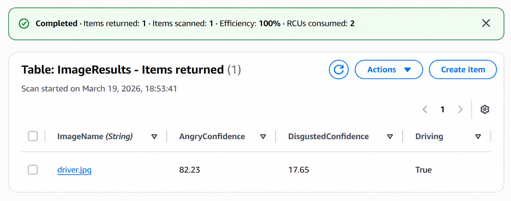
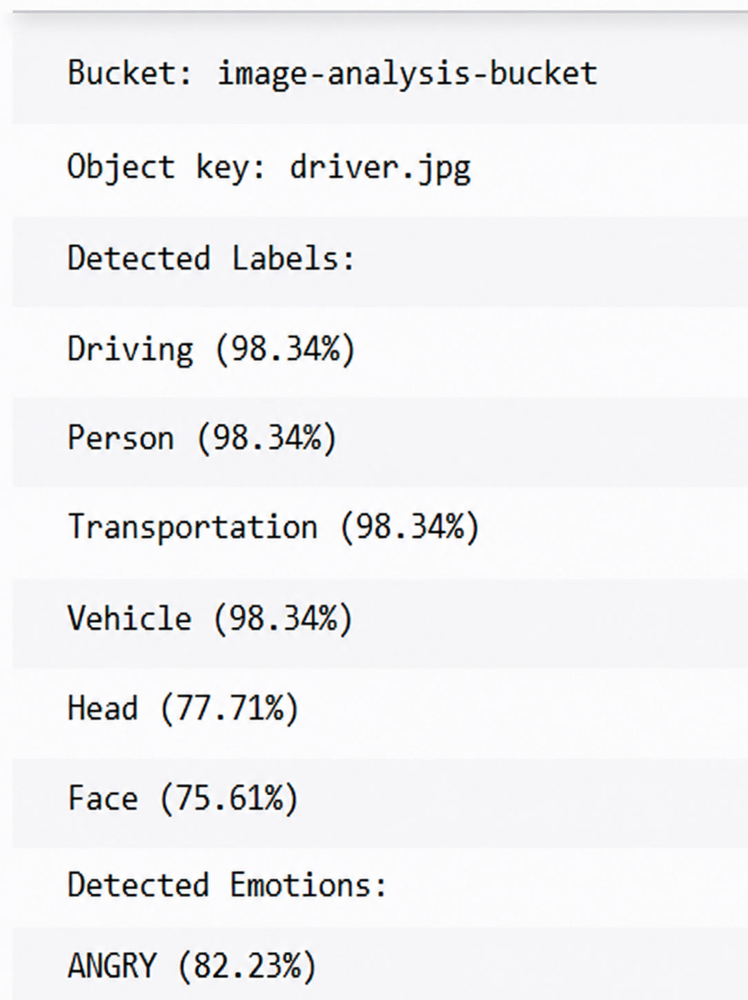
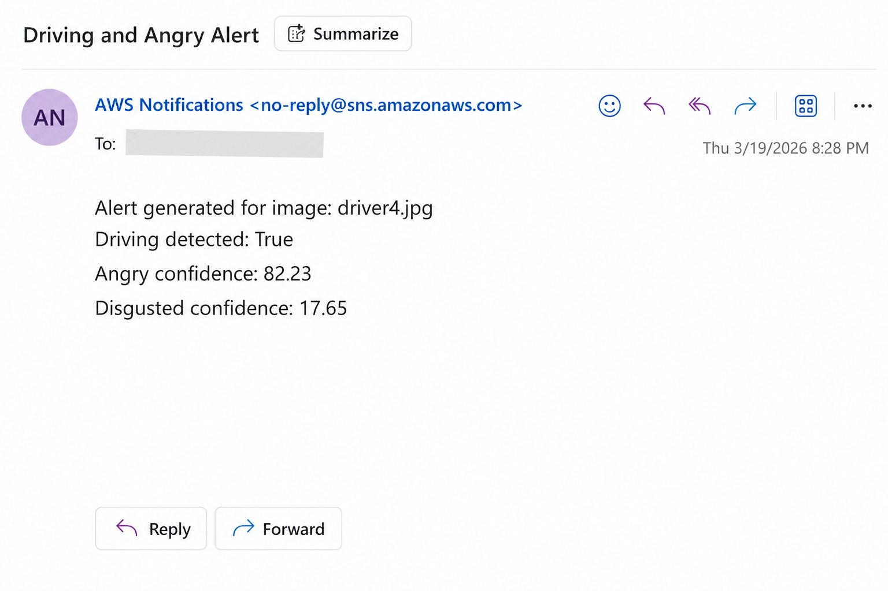

# ☁️ AWS Event-Driven Image Analysis Pipeline

An automated, event-driven image processing pipeline built with **AWS, Python and Boto3**.

The system processes uploaded images using **Amazon Rekognition**, stores analysis results in **DynamoDB**, and automatically sends an **SNS email alert** when predefined conditions are detected.

> **Portfolio Project:** Originally developed as part of my BSc (Hons) Computing studies and reorganised as a portfolio project to demonstrate cloud architecture, serverless computing, Infrastructure as Code and AWS automation.

---

## 📸 Project Preview

### System Architecture

The application uses an event-driven AWS architecture to automatically process images from upload through to analysis and notification.



### Amazon Rekognition Analysis

Uploaded images are automatically analysed for labels and facial emotions using Amazon Rekognition.



### DynamoDB Results

Processed image-analysis data is stored in DynamoDB for further event-driven processing.



### Automated SNS Alert

When the configured alert conditions are met, the pipeline automatically generates an SNS email notification.



---

## 🏗️ Architecture

```text
┌──────────────┐
│     EC2      │
│ Upload Client│
└──────┬───────┘
       │ Image Upload
       ▼
┌──────────────┐
│  Amazon S3   │
│ Image Storage│
└──────┬───────┘
       │ Object Created
       ▼
┌──────────────┐
│  Amazon SQS  │
│ Message Queue│
└──────┬───────┘
       │
       ▼
┌─────────────────────┐
│      Lambda 1       │
│   Image Processor   │
└──────────┬──────────┘
           │
           ▼
┌─────────────────────┐
│ Amazon Rekognition  │
│ Labels + Emotions   │
└──────────┬──────────┘
           │
           ▼
┌──────────────┐
│  DynamoDB    │
│Analysis Data │
└──────┬───────┘
       │ DynamoDB Stream
       ▼
┌─────────────────────┐
│      Lambda 2       │
│ Notification Logic  │
└──────────┬──────────┘
           │
           ▼
┌──────────────┐
│  Amazon SNS  │
│ Email Alert  │
└──────────────┘
```

### Processing Flow

**EC2 → S3 → SQS → Lambda → Rekognition → DynamoDB → DynamoDB Streams → Lambda → SNS**

This design separates image upload, processing, storage and notification into independent cloud components.

---

## 🚀 How It Works

### 1. Image Upload

A Python/Boto3 application running from the client environment uploads images to an **Amazon S3 bucket**.

### 2. Event Generation

When a new image enters S3, an object-created event sends a message to **Amazon SQS**.

SQS provides asynchronous communication between the storage and processing components.

### 3. Lambda Processing

The SQS message triggers the first **AWS Lambda** function.

The function extracts the S3 bucket and image key before submitting the image to Amazon Rekognition.

### 4. Image Analysis

Amazon Rekognition performs:

- Object and label detection
- Vehicle/driving-related detection
- Face detection
- Facial emotion analysis
- Confidence scoring

### 5. DynamoDB Storage

The processed results are stored in **Amazon DynamoDB**.

Example data:

```text
ImageName: driver.jpg
Driving: True
AngryConfidence: 82.23
DisgustedConfidence: 17.65
```

### 6. Event-Driven Alerting

New DynamoDB records generate **DynamoDB Stream** events, triggering the second Lambda function.

The notification condition used by the prototype is:

```text
Driving == True
AND
AngryConfidence > 80%
```

When both conditions are satisfied, the Lambda function publishes an alert through **Amazon SNS**, which sends the configured email notification.

---

## 🛠️ Technologies

| Technology | Purpose |
|---|---|
| **Python** | Application and Lambda logic |
| **Boto3** | Programmatic AWS interaction |
| **Amazon EC2** | Image-upload client environment |
| **Amazon S3** | Image object storage |
| **Amazon SQS** | Asynchronous messaging |
| **AWS Lambda** | Serverless processing |
| **Amazon Rekognition** | Image and facial-emotion analysis |
| **Amazon DynamoDB** | Analysis-result storage |
| **DynamoDB Streams** | Database event processing |
| **Amazon SNS** | Automated email notifications |
| **Amazon CloudWatch** | Logging and monitoring |
| **AWS CloudFormation** | Infrastructure as Code |

---

## 📁 Repository Structure

```text
aws-image-analysis-pipeline/
│
├── infrastructure/
│   └── cloudformation.yaml
│
├── lambda/
│   ├── image_processor/
│   │   └── lambda_function.py
│   │
│   └── notification/
│       └── lambda_function.py
│
├── scripts/
│   ├── create_ec2.py
│   ├── create_dynamodb.py
│   └── upload_images.py
│
├── docs/
│   └── images/
│       ├── architecture.png
│       ├── rekognition-results.png
│       ├── dynamodb-results.png
│       └── sns-alert.png
│
├── .gitignore
└── README.md
```

---

## 🧩 Key Components

### `image_processor`

The first Lambda function:

- Receives SQS events
- Extracts S3 image information
- Calls Amazon Rekognition
- Detects driving-related labels
- Extracts emotion confidence values
- Writes processed results to DynamoDB

### `notification`

The second Lambda function:

- Processes DynamoDB Stream events
- Reads newly created analysis records
- Evaluates the alert threshold
- Publishes qualifying alerts through SNS

### `cloudformation.yaml`

Provides reusable Infrastructure as Code for AWS resources used by the pipeline.

### `scripts`

Contains Boto3 automation for resource creation and image uploading.

---

## ⚙️ Configuration

The portfolio version uses environment variables rather than hard-coded account-specific configuration.

Example:

```bash
AWS_REGION=us-east-1
S3_BUCKET_NAME=your-image-analysis-bucket
DYNAMODB_TABLE=ImageResults
SNS_TOPIC_ARN=your-sns-topic-arn
AMI_ID=your-ami-id
```

> AWS credentials, account IDs and private configuration should **never be committed to the repository**.

---

## 🔐 Security & Reliability

The original implementation was developed within a restricted AWS Academy environment.

For a production implementation, I would introduce:

- **Least-privilege IAM roles** for each component
- **SQS Dead-Letter Queue (DLQ)** for failed processing
- **CloudWatch alarms** for Lambda failures and queue depth
- **AWS KMS encryption** where appropriate
- Restrictive **S3 bucket policies**
- **AWS CloudTrail** for auditing
- Input and event validation
- Improved retry and failure handling

These changes would improve the security, observability and resilience of the architecture.

---

## 📈 Future Improvements

Potential extensions include:

- Deploying the entire architecture through **AWS CDK, SAM, Terraform or CloudFormation**
- Automated unit and integration testing
- Dead-letter queue processing
- CloudWatch dashboards and alarms
- More advanced Rekognition result filtering
- API or web interface for image uploads
- Result visualisation dashboard
- S3 lifecycle policies for cost optimisation
- CI/CD deployment through GitHub Actions

---

## 💡 What I Learned

This project gave me practical experience designing and integrating a multi-service AWS application, including:

- Event-driven architecture
- Serverless computing
- Asynchronous messaging
- Infrastructure as Code
- Python AWS automation with Boto3
- NoSQL data storage
- Cloud-based image analysis
- Event-driven notifications
- Cloud monitoring and debugging
- Security and cost considerations

It also demonstrated how loosely coupled AWS services can be combined into an automated workflow rather than operating as isolated cloud resources.

---

## ⚠️ Project Note

This repository is a **portfolio reconstruction of an academic cloud-computing project**.

Environment-specific identifiers and university-specific resource names have been removed or generalised. Some implementation files have also been cleaned for public presentation while preserving the architecture and behaviour of the completed system.

---

## 👨‍💻 Author

**Sae Jang**

First-Class BSc (Hons) Computing Graduate  
Glasgow Caledonian University

Interested in **Software Engineering, Cloud Development, Artificial Intelligence and Full-Stack Development**.

### GitHub

[sjangx7](https://github.com/sjangx7)
